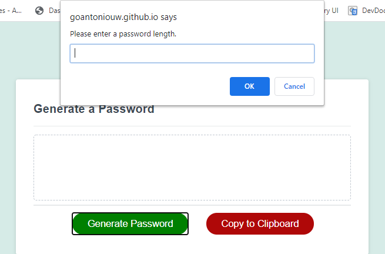
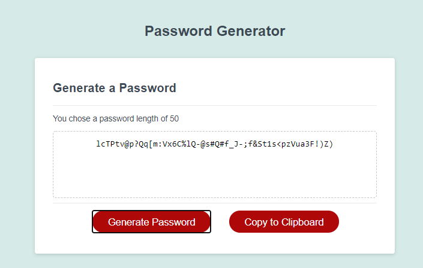

# 03 JavaScript: Password Generator

This app lets users create a random strong password. You must choose between a length of 8 and 128 characters. Prompts will then ask you if you would like to use uppercase, lowercase,
Numbers or special characters. If you decline all options, you will not get a password. You must choose at least one option for a strong password.

# To do’s
There is a copy to clipboard button that is not currently working. This is something that I think will be nice to have with this app.

# Live link
https://goantoniouw.github.io/password-generator/

# Screenshots
Once you click the generate password button prompts will guide you through the process of picking a password that meets your standards. 

This is the generated password after following all the prompts.  

